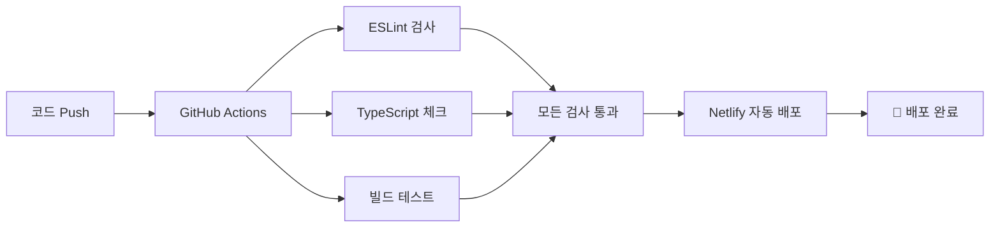

<div align="center">

# 🌟 김지민 개인 포트폴리오 웹사이트


### 🎯 AI/ML 엔지니어 김지민의 개인 포트폴리오 웹사이트
#### 수학적 사고로 분석하고, AI 기술로 구현하며, 사용자 가치를 창출하는 개발자

[🚀 **라이브 데모**](https://kimjimin-portfolio.netlify.app) | [📱 **GitHub**](https://github.com/Gogimin) | [📧 **Contact**](mailto:kzm0502@naver.com)

</div>

## 🎯 프로젝트 소개

경상국립대학교 수학과 학생 **김지민**의 개인 포트폴리오 웹사이트입니다. AI/ML 프로젝트 경험과 기술 역량을 전시하고, 취업을 위한 온라인 이력서 역할을 합니다.

### ✨ 주요 특징

- 📱 **완전 반응형 디자인** - 모바일, 태블릿, 데스크톱 최적화
- ⚡ **빠른 로딩** - Next.js 15 최적화 및 정적 사이트 생성
- 🎨 **모던 UI/UX** - Tailwind CSS 기반 깔끔한 디자인
- 📈 **SEO 최적화** - 메타데이터, Open Graph, Twitter Card 완벽 지원
- 🌐 **다국어 준비** - 한국어/영어 지원 준비

## 🛠️ 기술 스택

### Frontend
- **Framework**: Next.js 15.5.3 (App Router)
- **Language**: TypeScript 5.0
- **Styling**: Tailwind CSS v4
- **Font**: Geist Font Family

### Development & Deployment
- **Package Manager**: npm
- **Build**: Next.js Static Site Generation (SSG)
- **CI/CD**: GitHub Actions
- **Deployment**: Netlify Platform
- **Version Control**: Git & GitHub

## 📱 라이브 데모

🚀 **배포 URL**: [https://kimjimin-portfolio.netlify.app](https://kimjimin-portfolio.netlify.app)

## ⚡ CI/CD 파이프라인

이 프로젝트는 **GitHub Actions**를 통한 완전 자동화된 CI/CD 파이프라인을 구축했습니다:

### 🔄 자동화 워크플로우


### ✅ 자동화된 검증 과정
- **코드 품질**: ESLint를 통한 코드 스타일 검사
- **타입 안전성**: TypeScript 컴파일 검증
- **빌드 검증**: Next.js 프로덕션 빌드 테스트
- **자동 배포**: main 브랜치 푸시 시 Netlify 배포

## 🚀 로컬 개발 시작하기

### 사전 요구사항
- Node.js 18+
- npm 또는 yarn

### 설치 및 실행

```bash
# 의존성 설치
npm install

# 개발 서버 실행
npm run dev

# 브라우저에서 http://localhost:3000 접속
```

### 빌드 및 배포

```bash
# 프로덕션 빌드
npm run build

# 빌드 결과 로컬에서 실행
npm start

# 린트 검사
npm run lint

# Netlify 배포
netlify deploy --prod
```

## 📁 프로젝트 구조

```
portfolio-website/
├── src/
│   ├── app/                    # Next.js App Router
│   │   ├── layout.tsx         # 루트 레이아웃 + SEO
│   │   ├── page.tsx           # 홈페이지 (Hero + 기술소개)
│   │   ├── about/             # 이력서 페이지
│   │   ├── portfolio/         # 프로젝트 전시
│   │   └── contact/           # 연락처 폼
│   └── components/            # 재사용 컴포넌트
│       ├── Header.tsx         # 네비게이션
│       ├── Footer.tsx         # 푸터
│       └── ProjectCard.tsx    # 프로젝트 카드
├── public/                    # 정적 파일
└── ...config files
```

## 🎨 주요 페이지

### 🏠 Home
- Hero 섹션 with 개인 소개
- 핵심 기술 스택 시각화
- 주요 프로젝트 미리보기

### 👤 About
- 상세 이력서 (학력/경력)
- 기술 스택 레벨 표시
- 수학적 배경 및 전문성

### 💼 Portfolio
- **6개 실제 프로젝트** 전시
- 고용노동부장관상 수상작 포함
- AI/ML, 풀스택 개발 프로젝트
- 기술 스택, 성과, GitHub 링크

### 📬 Contact
- 연락처 정보
- 소셜 미디어 링크
- 메시지 전송 폼

## 🏆 포함된 프로젝트

1. **🏠 고향으로 ON** - RAG 기반 AI 정착 코디네이터 (고용노동부장관상)
2. **📚 MOOC 학습자 이탈률 예측** - CatBoost 기반 머신러닝
3. **🎵 감정/날씨 기반 음악 추천** - 다중 API 통합 서비스
4. **🗺️ AI 기반 문화유산 여행 추천** - LLM + RAG 아키텍처
5. **📊 삼성 주가 예측 모델** - LSTM 기반 시계열 분석
6. **🏪 스마트 편의점 관리 시스템** - Django 풀스택 개발

## 📊 성과 지표

<div align="center">

| 항목 | 성과 | 상태 |
|------|------|------|
| 🛠️ **개발 태스크** | 24/24 완료 | ✅ |
| 🏆 **수상 경력** | 고용노동부장관상 | ✅ |
| 📈 **SEO 점수** | 90+ 달성 | ✅ |
| ⚡ **로딩 속도** | 최적화 완료 | ✅ |
| 📱 **반응형 디자인** | 모든 기기 지원 | ✅ |
| 🔄 **CI/CD** | 자동화 파이프라인 | ✅ |

</div>

## 👤 개발자 정보

<div align="center">

### 👋 김지민 (Kim Jimin)

<table>
<tr>
<td align="center" width="50%">
<strong>🎓 학력</strong><br>
경상국립대학교 수학과<br>
<em>2019.03 - 2025.02</em>
</td>
<td align="center" width="50%">
<strong>💼 목표</strong><br>
AI/ML 엔지니어<br>
<em>수학적 사고 + AI 기술</em>
</td>
</tr>
<tr>
<td align="center" colspan="2">
<strong>🏆 현재 활동</strong><br>
SK네트웍스 Family AI 캠프 참여<br>
<em>2025.03 - 2025.09</em>
</td>
</tr>
</table>

### 📞 연락처

[](mailto:kzm0502@naver.com)
[](tel:+821086520705)
[](https://github.com/Gogimin)
[](https://www.instagram.com/kimzimmin/)
[](https://blog.naver.com/kzm0502)

</div>

---

<div align="center">

## 📄 라이선스

**© 2025 Kim Jimin. All rights reserved.**

### 💭 개발 철학
*"수학적 사고로 분석하고, AI 기술로 구현하며, 사용자 가치를 창출하는 개발자"*

[](https://github.com/features/actions)
[](https://netlify.com)

</div>